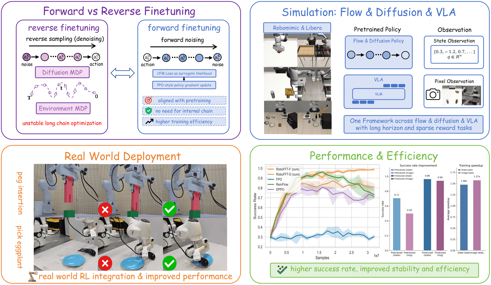

# RoboFFT: Finetuning Generative Robot Policy via Online Reinforcement Learning with Forward Process


<p align="center">
  <a href="#installation">Installation</a> |
  <a href="#data-and-checkpoints">Data & Checkpoints</a> |
  <a href="#quick-start">Quick Start</a> |
  <a href="#supported-experiments">Supported Experiments</a> |
  <a href="#citation">Citation</a>
</p>
<p align="center">
  
</p>

## Overview

**RoboFFT** is an online reinforcement learning framework for finetuning generative robot policies through the **forward noising process**. Generative policies such as diffusion policies and flow / rectified-flow policies can model complex action distributions from demonstrations, but imitation learning alone can be limited by suboptimal demonstrations and distribution shift. RoboFFT uses online environment interaction to improve these pretrained policies while keeping the finetuning objective close to the original denoising / flow-matching training objective.

The key idea is to apply a PPO-style policy-gradient update in the forward noising space and use a weighted denoising loss as a surrogate likelihood. Compared with reverse-process finetuning methods that optimize through the full denoising trajectory, this formulation avoids treating the internal reverse chain as a long decision process and is intended to improve training stability and efficiency while remaining easy to integrate into existing imitation-learning pipelines.

This release focuses on the **Robomimic simulation experiments** from the paper:

- `robofft-f/`: **RoboFFT-F**, the ReFlow / flow-policy implementation.
- `robofft-d/`: **RoboFFT-D**, the diffusion-policy implementation.

The VLA and real-world robot experiments described in the paper are not included in this release.

## Repository Layout

```text
robofft/
├── README.md                      # this file
├── assets/                         # teaser / figures for documentation
├── data/                           # shared processed Robomimic data
│   ├── robomimic/                  # train.npz and normalization.npz
│   └── checkpoints/                # released base-policy checkpoints
├── log/
│   ├── robofft-f/                  # RoboFFT-F logs and finetuned checkpoints
│   └── robofft-d/                  # RoboFFT-D logs and finetuned checkpoints
├── robofft-f/                      # ReFlow / flow-policy branch
└── robofft-d/                      # diffusion-policy branch
```

The two implementation branches `robofft-f` and `robofft-d` keep separate Python environments because their upstream dependencies and implementation details may differ. By default, however, they share the same processed Robomimic data and released pretrained checkpoints.

## Installation

Use two separate conda environments, one for each branch.

### RoboFFT-F

```bash
cd robofft-f
conda create -n robofft-f python=3.8 -y
conda activate robofft-f
pip install -e .
pip install -e .[robomimic]
bash script/set_path.sh
```

### RoboFFT-D

```bash
cd robofft-d
conda create -n robofft-d python=3.8 -y
conda activate robofft-d
pip install -e .
pip install -e .[robomimic]
bash script/set_path.sh
```

See `robofft-f/README.md` and `robofft-d/README.md` for branch-specific environment notes. In most cases, you only need to install the branch you are going to run.

## Data and Checkpoints

The launchers check the configured paths before training. If a required file is missing, `script/run.py` attempts to download it to the configured location. The checked fields are:

```text
train_dataset_path
normalization_path
base_policy_path
```

The release keeps the original hard-coded download style. 
<!--Official RoboFFT asset URLs should be filled in the top-level TODO dictionaries in `robofft-f/script/download_url.py` and `robofft-d/script/download_url.py`-->


Specifically, fill these dictionaries after uploading the assets:

```python
ROBOFFT_RELEASE_TRAIN_URLS
ROBOFFT_RELEASE_NORMALIZATION_URLS
ROBOFFT_RELEASE_CHECKPOINT_URLS
```

Recommended released checkpoint layout:

```text
${ROBOFFT_F_DATA_DIR}/checkpoints/robofft-f/reflow/<task>/state/state_3000.pt
${ROBOFFT_F_DATA_DIR}/checkpoints/robofft-f/reflow/<task>/image/state_2000.pt
${ROBOFFT_D_DATA_DIR}/checkpoints/robofft-d/diffusion/<task>/state/state_3000.pt
${ROBOFFT_D_DATA_DIR}/checkpoints/robofft-d/diffusion/<task>/image/state_2000.pt
```

Recommended processed Robomimic layout:

```text
${ROBOFFT_F_DATA_DIR}/robomimic/<task>/train.npz
${ROBOFFT_F_DATA_DIR}/robomimic/<task>/normalization.npz
${ROBOFFT_F_DATA_DIR}/robomimic/<task>-img/train.npz
${ROBOFFT_F_DATA_DIR}/robomimic/<task>-img/normalization.npz
```

The same layout is used by RoboFFT-D because `ROBOFFT_D_DATA_DIR` defaults to the same root-level `data/` directory.

## Quick Start

The examples below use `can`. Replace `can` with any supported task.

### RoboFFT-F finetuning

```bash
cd robofft-f
conda activate robofft-f
bash script/set_path.sh

TASK=can
python script/run.py \
  --config-name=robofft_reflow_mlp \
  --config-dir=cfg/robomimic/finetune/${TASK} \
  wandb=null
```

Pixel-input version:

```bash
python script/run.py \
  --config-name=robofft_reflow_mlp_img \
  --config-dir=cfg/robomimic/finetune/${TASK} \
  wandb=null
```

### RoboFFT-D finetuning

```bash
cd robofft-d
conda activate robofft-d
bash script/set_path.sh

TASK=can
python script/run.py \
  --config-name=robofft_diffusion_mlp \
  --config-dir=cfg/robomimic/finetune/${TASK} \
  wandb=null
```

Pixel-input version:

```bash
python script/run.py \
  --config-name=robofft_diffusion_mlp_img \
  --config-dir=cfg/robomimic/finetune/${TASK} \
  wandb=null
```

Set `wandb=null` to disable Weights & Biases logging. Remove it or set your own WandB configuration if you want experiment tracking.

## Supported Experiments

### Tasks

This release supports all the four Robomimic tasks:

```text
lift, can, square, transport
```

Each task has state-input and pixel-input variants for the main RoboFFT-F / RoboFFT-D experiments.

### Main methods

| Branch | Method | Policy family | State input | Pixel input | Config name |
|---|---|---|---:|---:|---|
| `robofft-f/` | RoboFFT-F | ReFlow / flow policy | yes | yes | `robofft_reflow_mlp`, `robofft_reflow_mlp_img` |
| `robofft-d/` | RoboFFT-D | diffusion policy | yes | yes | `robofft_diffusion_mlp`, `robofft_diffusion_mlp_img` |

### Baselines included in this release

| Branch | Baseline | State input | Pixel input | Config name |
|---|---|---:|---:|---|
| `robofft-f/` | FPO-style forward finetuning baseline | yes | yes | `ft_fpo_reflow_mlp`, `ft_fpo_reflow_mlp_img` |
| `robofft-f/` | ReinFlow-style reverse finetuning baseline | yes | yes | `ft_ppo_reflow_mlp`, `ft_ppo_reflow_mlp_img` |
| `robofft-d/` | DPPO baseline | yes | yes | `ft_ppo_diffusion_mlp`, `ft_ppo_diffusion_mlp_img` |
| `robofft-d/` | DRWR baseline | yes | no | `ft_rwr_diffusion_mlp` |

DRWR is currently provided only for state-input Robomimic experiments in this release.

## Pretraining

Pretraining is optional if you use the released base-policy checkpoints. To pretrain policies from processed Robomimic data, use the following commands.

### ReFlow pretraining for RoboFFT-F

```bash
cd robofft-f
TASK=can

python script/run.py \
  --config-name=pre_reflow_mlp \
  --config-dir=cfg/robomimic/pretrain/${TASK} \
  wandb=null

python script/run.py \
  --config-name=pre_reflow_mlp_img \
  --config-dir=cfg/robomimic/pretrain/${TASK} \
  wandb=null
```

### Diffusion pretraining for RoboFFT-D

```bash
cd robofft-d
TASK=can

python script/run.py \
  --config-name=pre_diffusion_mlp \
  --config-dir=cfg/robomimic/pretrain/${TASK} \
  wandb=null

python script/run.py \
  --config-name=pre_diffusion_mlp_img \
  --config-dir=cfg/robomimic/pretrain/${TASK} \
  wandb=null
```

## Online Finetuning and Baselines

### RoboFFT-F and flow-side baselines

```bash
cd robofft-f
TASK=can

# RoboFFT-F
python script/run.py --config-name=robofft_reflow_mlp --config-dir=cfg/robomimic/finetune/${TASK} wandb=null
python script/run.py --config-name=robofft_reflow_mlp_img --config-dir=cfg/robomimic/finetune/${TASK} wandb=null

# FPO-style baseline
python script/run.py --config-name=ft_fpo_reflow_mlp --config-dir=cfg/robomimic/finetune/${TASK} wandb=null
python script/run.py --config-name=ft_fpo_reflow_mlp_img --config-dir=cfg/robomimic/finetune/${TASK} wandb=null

# ReinFlow-style baseline
python script/run.py --config-name=ft_ppo_reflow_mlp --config-dir=cfg/robomimic/finetune/${TASK} wandb=null
python script/run.py --config-name=ft_ppo_reflow_mlp_img --config-dir=cfg/robomimic/finetune/${TASK} wandb=null
```

### RoboFFT-D and diffusion-side baselines

```bash
cd robofft-d
TASK=can

# RoboFFT-D
python script/run.py --config-name=robofft_diffusion_mlp --config-dir=cfg/robomimic/finetune/${TASK} wandb=null
python script/run.py --config-name=robofft_diffusion_mlp_img --config-dir=cfg/robomimic/finetune/${TASK} wandb=null

# DPPO baseline
python script/run.py --config-name=ft_ppo_diffusion_mlp --config-dir=cfg/robomimic/finetune/${TASK} wandb=null
python script/run.py --config-name=ft_ppo_diffusion_mlp_img --config-dir=cfg/robomimic/finetune/${TASK} wandb=null

# DRWR baseline, state input only
python script/run.py --config-name=ft_rwr_diffusion_mlp --config-dir=cfg/robomimic/finetune/${TASK} wandb=null
```

## Evaluation

Pass the checkpoint path explicitly through `base_policy_path`.

### ReFlow / RoboFFT-F evaluation

```bash
cd robofft-f
TASK=can
python script/run.py \
  --config-name=eval_reflow_mlp \
  --config-dir=cfg/robomimic/eval/${TASK} \
  base_policy_path=/path/to/state.pt \
  wandb=null
```

### Diffusion / RoboFFT-D evaluation

```bash
cd robofft-d
TASK=can
python script/run.py \
  --config-name=eval_diffusion_mlp \
  --config-dir=cfg/robomimic/eval/${TASK} \
  base_policy_path=/path/to/state.pt \
  ft_denoising_steps=10 \
  wandb=null
```

Note that the evaluation program is inherited from ReinFlow and DPPO and we haven't yet specifically validated the config files. Please check the `.yaml` files and perform necessary modifications before running.

## Practical Notes

- Run `bash script/set_path.sh` inside the branch you are using before launching experiments.
- The default data directory is shared by both branches, while logs are branch-specific.
- If a required dataset, normalization file, or base checkpoint is missing, the launcher will try to download it using the hard-coded URL table in `script/download_url.py`.
- The public release still needs official asset URLs to be filled in before automatic download works end-to-end.
- Robomimic / robosuite rendering may require a proper MuJoCo rendering backend on headless servers.

## Citation

If you find this repository useful, please cite RoboFFT. The BibTeX entry below should be updated once the final paper metadata is available.

```bibtex
@inproceedings{robofft2026,
  title     = {RoboFFT: Finetuning Generative Robot Policy via Online Reinforcement Learning with Forward Process},
  author    = {RoboFFT Author(s)},
  booktitle = {Conference on Robot Learning},
  year      = {2026},
  note      = {Manuscript under review}
}
```

## Acknowledgements

This release builds on prior open-source implementations for generative robot policy finetuning, including the ReinFlow and DPPO codebases. We also thank the Robomimic and robosuite projects for providing the simulation benchmark infrastructure used by the released experiments.
